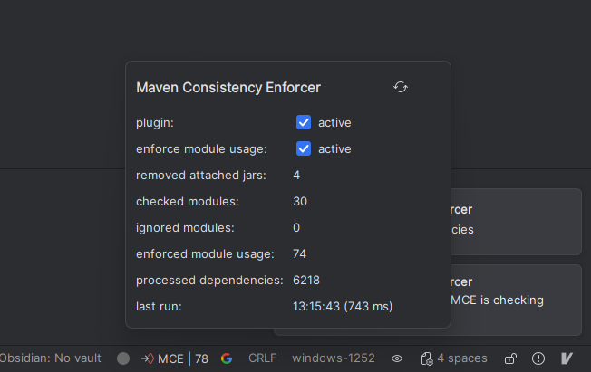
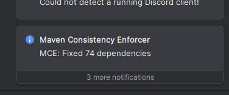
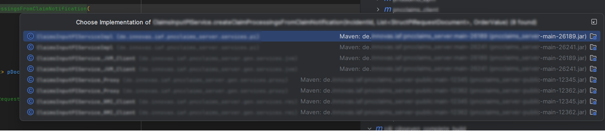
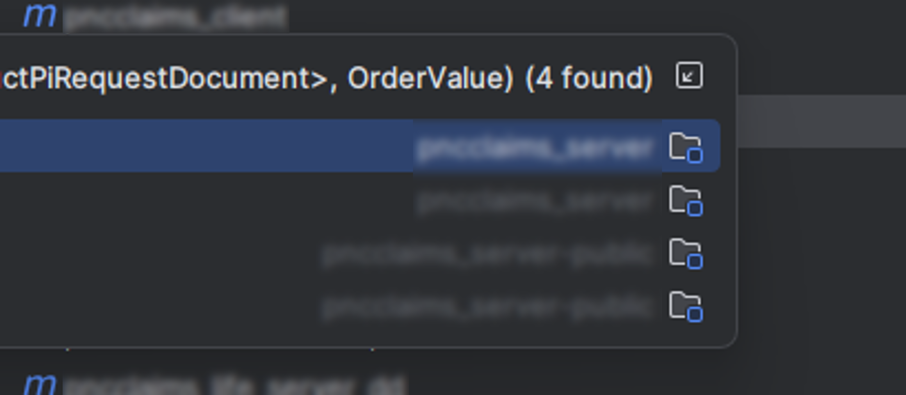
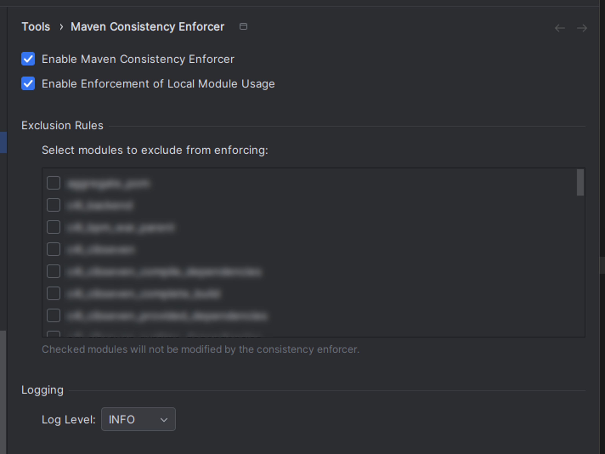

# Jetbrains Marketplace

# Maven Consistency Enforcer (MCE)

Stop fighting ghosts in your classpath! MCE ensures your IntelliJ IDEA run-time classpath matches the code in your workspace in multi-module Maven projects by detecting and removing stale JAR artifacts and preferring local module sources when available.

What it does:
- Automatically removes attached JARs that shadow local modules
- Replaces library entries with module dependencies when a matching module exists
- Per-module enforcement configuration and global "All modules" toggle
- Shows notifications and a status bar widget with enforcement metrics

Default behavior:
- Triggers automatically after Maven > Reload Project and (optionally) on project startup
- Shows notifications about fixed dependencies
- Re-enforces consistency on every Maven reload

## Screenshots

Below are a few screenshots illustrating MCE in action.

### Status bar widget
Displays enforcement state and quick toggles for the plugin.

  

### Notification example
Informational notifications when the plugin fixes inconsistencies.

  

### Before / After: Module enforcement
The plugin can replace library entries with local module dependencies. Examples (blurred to focus on the UI):

  

  

### Settings
Quick access to per-module enforcement configuration and the global toggle.

  

